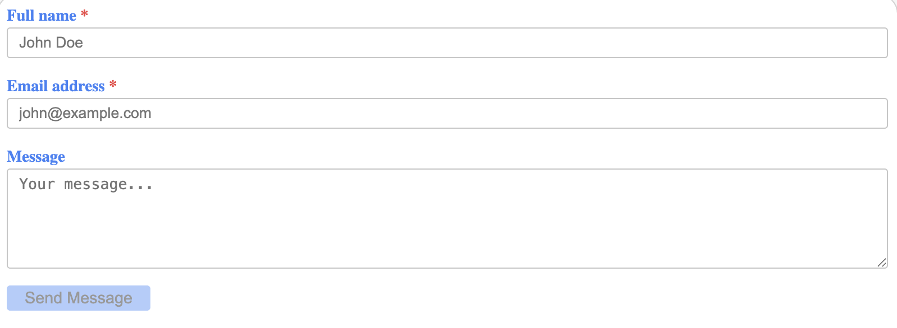
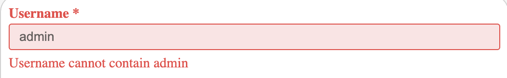
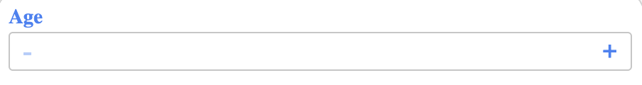
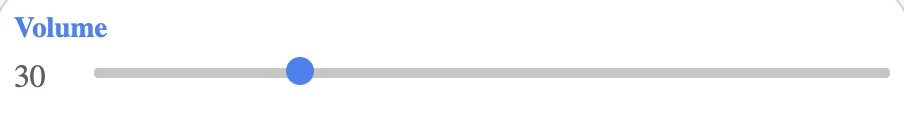
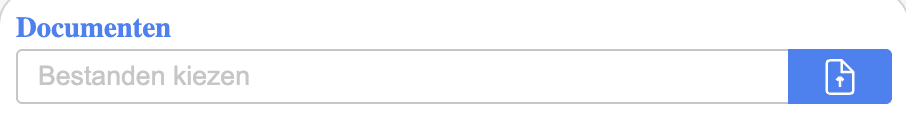
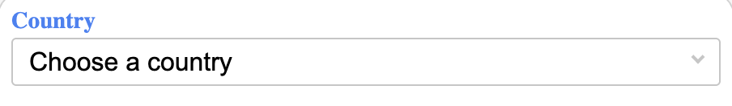
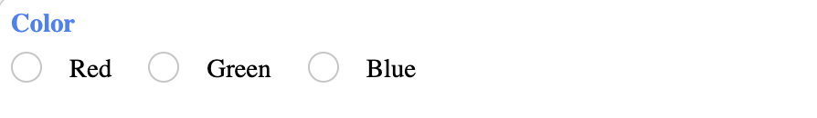
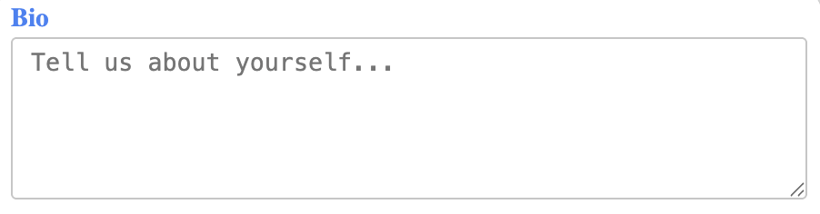
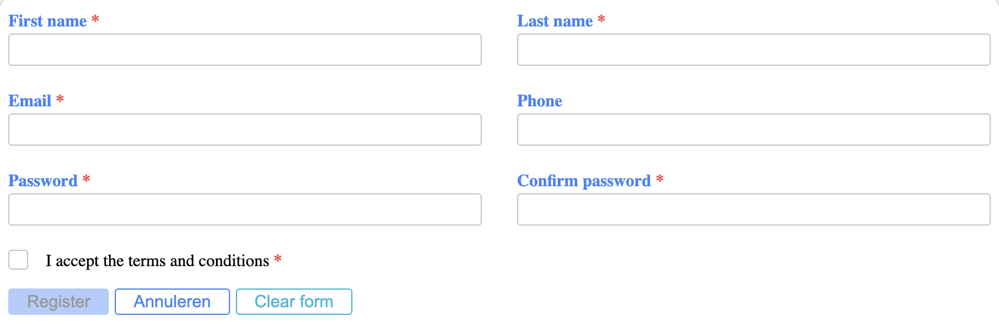

# @sio-group/form-react

[](https://opensource.org/licenses/ISC)


A powerful, type-safe React form framework. This package provides ready-to-use form components with built-in validation, layout management, and extensive customization options. This package is designed to work seamlessly with `@sio-group/form-builder` and `@sio-group/form-validation`, but can be used independently.

Part of the SIO Form ecosystem, it consumes form definitions from `@sio-group/form-builder` and renders them with full type safety and accessibility in mind.

---

## Installation

```bash
npm install @sio-group/form-react
```

**Peer Dependencies:**
- `react`: ^19.0.0
- `react-dom`: ^19.0.0

---

## Quick Example

```tsx
import { Form } from '@sio-group/form-react';
import { formBuilder } from '@sio-group/form-builder';

function ContactForm() {
  const fields = formBuilder()
    .addText('name', {
      label: 'Full name',
      required: true,
      placeholder: 'John Doe'
    })
    .addEmail('email', {
      label: 'Email address',
      required: true,
      placeholder: 'john@example.com'
    })
    .addTextarea('message', {
      label: 'Message',
      rows: 5,
      placeholder: 'Your message...'
    })
    .getFields();

  return (
    <Form
      fields={fields}
      submitAction={(values) => console.log('Form submitted:', values)}
      submitLabel="Send Message"
    />
  );
}
```


*A simple contact form*

---

## Features

- ✅ **Type-safe** - Full TypeScript support with inferred types
- ✅ **Built-in validation** - Automatic validation based on field configuration
- ✅ **Responsive layout** - Grid system with breakpoints (sm, md, lg)
- ✅ **Customizable buttons** - Multiple button variants and colors
- ✅ **Form state management** - Tracks dirty, touched, focused, and error states
- ✅ **Accessibility** - ARIA attributes and keyboard navigation
- ✅ **Offline support** - Disable forms when offline
- ✅ **File uploads** - Built-in file handling with validation
- ✅ **Icons** - Support for HTML and component icons
- ✅ **Flexible containers** - Custom form and button containers
- ✅ **Switch** - Toggle component with direct action support
- ✅ **Search** - Async search with inline or external result rendering

---

## Core Components

### Form Component

The main component that renders your form with all fields and buttons.

```tsx
import { Form } from '@sio-group/form-react';

<Form
  fields={fields}
  layout={layoutConfig}
  submitShow={true}
  submitAction={handleSubmit}
  submitLabel="Save"
  cancelShow={true}
  cancelAction={handleCancel}
  cancelLabel="Cancel"
  buttons={buttonConfig}
  extraValidation={customGlobalValidation}
  className="my-form"
  container={CustomContainer}
  buttonContainer={CustomButtonContainer}
/>
```

### Individual Field Components

You can also use field components independently:

```tsx
import {
  useForm,
  Input,
  Textarea,
  Select,
  Radio,
  Checkbox,
  Switch,
  NumberInput,
  RangeInput,
  DateInput,
  FileInput,
  TextInput,
} from '@sio-group/form-react';

// Use with useForm hook
const { register } = useForm();

return (
  <Input {...register('username', fieldConfig)} />
);
```

---

## API Reference

### Form Props

| Prop                 | Type                           | Default                  | Description                                       |
|----------------------|--------------------------------|--------------------------|---------------------------------------------------|
| `fields`             | `FormField[]`                  | (required)               | Array of form fields                              |
| `submitAction`       | `(values: any) => void`        | (required)               | Submit handler                                    |
| `layout`             | `FormLayout[]`                 | `[]`                     | Custom layout configuration                       |
| `submitShow`         | `boolean`                      | `true`                   | Show submit button                                |
| `submitLabel`        | `string`                       | `'Bewaar'`               | Submit button text                                |
| `submitOnlyDirty`    | `boolean`                      | `false`                  | Disable submit button when the form is not dirty  |
| `cancelShow`         | `boolean`                      | `false`                  | Show cancel button                                |
| `cancelLabel`        | `string`                       | `'Annuleren'`            | Cancel button text                                |
| `cancelAction`       | `() => void`                   | -                        | Cancel handler                                    |
| `cancelOnlyDirty`    | `boolean`                      | `false`                  | Show cancel button only when form is dirty        |
| `buttons`            | `(ButtonProps \| LinkProps)[]` | `[]`                     | Additional buttons                                |
| `extraValidation`    | `(values: any) => boolean`     | `() => true`             | Extra validation                                  |
| `className`          | `string`                       | -                        | CSS class for form container                      |
| `style`              | `React.CSSProperties`          | -                        | Inline styles                                     |
| `disableWhenOffline` | `boolean`                      | `true`                   | Disable form when offline                         |
| `container`          | `React.ComponentType`          | `DefaultContainer`       | Custom form container                             |
| `buttonContainer`    | `React.ComponentType`          | `DefaultButtonContainer` | Custom button container                           |

### Layout Configuration

The `layout` prop allows you to arrange fields in a responsive grid:

```tsx
const layout = [
  { 
    layout: { sm: 12, md: 6, lg: 4 },  // Responsive column spans
    fields: ['name', 'email']           // Fields in this row
  },
  {
    layout: { sm: 12, md: 12, lg: 8 },
    fields: ['message'],
    className: 'custom-row',            // Optional CSS class
    style: { marginBottom: '2rem' }     // Optional inline styles
  }
];
```

**Breakpoint options:**
- `sm`: Small (≥640px)
- `md`: Medium (≥768px)
- `lg`: Large (≥1024px)

### Layout with containers

Wrap a group of fields in a custom container — for example a `Card` — by providing the `container` prop on a layout entry. The column classes are applied to the outer wrapper, the container renders inside it.

```tsx
import { Card } from '@sio-group/ui-card';

const layout = [
  {
    layout: { md: 6 },
    container: ({ children }) => <Card title="Persoonlijke gegevens">{children}</Card>,
    fields: ['firstName', 'lastName'],
  },
  {
    layout: { md: 6 },
    container: ({ children }) => <Card title="Contactgegevens">{children}</Card>,
    fields: ['email', 'phone'],
  },
];
```

### Button Configuration

Buttons can be configured as an array using the props from `@sio-group/ui-core`.

```tsx
const buttons = [
  {
    type: 'button',
    variant: 'primary',
    color: 'success',
    label: 'Save Draft',
    onClick: () => saveDraft()
  },
  {
    type: 'button',
    variant: 'secondary',
    color: 'warning',
    label: 'Reset',
    onClick: () => reset()
  },
  {
    type: 'link',
    color: 'info',
    label: 'Help',
    href: '/help'
  }
];
```

Button and link properties are inherited from the UI components:

- `Button` from `@sio-group/ui-core`
- `Link` from `@sio-group/ui-core`

Refer to their documentation for all available props.

[@sio-group/ui-core](https://github.com/SiO-group/UI-React/tree/main/packages/ui-core)

---

## Hooks

### useForm

A powerful hook for managing form state independently:

```tsx
import { useForm } from '@sio-group/form-react';

function CustomForm() {
  const { register, getValues, isValid, isBusy, reset, submit } = useForm();

  const handleSubmit = async () => {
    await submit(async (values) => {
      await api.save(values);
    });
  };

  return (
    <form onSubmit={handleSubmit}>
      <Input {...register('username', fieldConfig)} />
      <button type="submit" disabled={!isValid() || isBusy()}>
        Submit
      </button>
    </form>
  );
}
```

**useForm Return Value:**

| Method                   | Description                    |
|--------------------------|--------------------------------|
| `register(name, config)` | Register a field and get props |
| `unregister(name)`       | Remove a field from form       |
| `setValue(name, value)`  | Set field value                |
| `getValues()`            | Get all form values            |
| `getValue(name)`         | Get single field value         |
| `reset()`                | Reset form state               |
| `isValid()`              | Check if form is valid         |
| `isDirty()`              | Check if form has changes      |
| `isBusy()`               | Check if form is submitting    |
| `submit(handler)`        | Submit form with handler       |
| `getField(name)`         | Get field state                |

### Conditional Fields

You can dynamically render fields based on other field values.

```tsx
import { useForm, Input, Checkbox } from '@sio-group/form-react';

function Example() {
  const { register, getValue } = useForm();
  
  return (
    <>
      <Checkbox
        {...register('subscribe', { 
          name: 'subscribe', 
          type: 'checkbox', 
          config: { label: 'Subscribe to newsletter' } 
        })} 
      />

      {getValue('subscribe') && (
        <Input
          {...register('email', {
            name: 'email',
            type: 'email',
            config: {
              label: 'Email address',
              required: true
            }
          })}
        />
      )}
    </>
  );
}
```

### Custom Validation

Default validation is automatically derived from the field configuration (`required`, `min`, `max`, `email`, etc.).
Additional validation rules can be added using the validations array.

```tsx
<Input
  {...register('username', {
    name: 'username',
    type: 'text',
    config: {
      label: 'Username',
      required: true,
      validations: [
        (value) => value.length < 3 ? 'Username must contain at least 3 characters' : null,
        (value) => value.includes('admin') ? 'Username cannot contain admin' : null
      ]
    },
  })}
/>
```


*Custom validation for admin in username*

### Imperative API via ref

Use a ref to call form methods from outside the component — useful for updating field values in response to WebSocket events or other external triggers.

```
import { useRef } from 'react';
import { Form } from '@sio-group/form-react';

function UserEdit() {
  const formRef = useRef(null);

  // update specific fields without re-mounting the form
  useWebSocket('user:updated', (payload) => {
    formRef.current?.setValues(payload.updates);
  });
  
  return (
    <Form
      ref={formRef}
      ...
    />
  )
}
```

**Available imperative methods:**

| Method                                       | Description                     |
|----------------------------------------------|---------------------------------|
| `setValues(values: Record<string, unknown>)` | Update one or more field values |
| `getValues()`                                | Read current form values        |
| `reset()`                                    | Reset form to initial state     |

---

## Field Components

### Input Types

All standard HTML input types are supported:

- `text`, `search`, `email`, `tel`, `password`, `url`
- `number` (with spinner options)
- `range` (with value display)
- `date`, `time`, `datetime-local`
- `color`
- `hidden`
- `file` (with file validation)

### Specialized Components

#### NumberInput

```tsx
<NumberInput
  {...register('age', {
    name: "age",
    type: "number",
    config: {
      label: "Age",
      min: 0,
      max: 120,
      step: 1,
      spinner: 'horizontal' // or "vertical", true, false
    }
  }) as NumberFieldProps}
/>
```


*Number input with horizontal spinner*

#### RangeInput

```tsx
<RangeInput
  {...register('volume', {
    name: "volume",
    type: "range",
    config: {
      label: "Volume",
      min: 0,
      max: 120,
      step: 1,
      showValue: true,
    }
  }) as NumberFieldProps}
/>
```


*Range input with shown value*

#### FileInput

```tsx
<FileInput
  {...register('documents', {
    name: "documents",
    type: "file",
    config: {
      label: "Documenten",
      accept: ".pdf,.doc",
      multiple: true,
      filesize: 5120, // 5MB in KB
      capture: false,
      onFileRemove: (file) => console.log('Removed:', file),
      onRemoveAll: (files) => console.log('All removed:', files)
    }
  }) as FileFieldProps}
/>
```


*Multiple file input*

#### SearchInput

The search input supports asynchronous data fetching via the `onSearch` configuration.
Results can be rendered inline or handled externally depending on `renderMode`.

```tsx
import { Input } from '@sio-group/form-react';

<Input
  {...register('user', {
    name: 'user',
    type: 'search',
    config: {
      label: 'Search user',
      onSearch: async (query) => {
        const res = await fetch(`/api/users?q=${query}`);
        return res.json();
      },
      optionLabel: (user) => user.name,
      optionValue: (user) => user.id,
      renderMode: 'inline',
      debounce: 300,
      minLength: 3,
      onResults: (users, loading) => {
        setResults(users);
        setLoadingState(loading);
      },
      onSelect: (user) => setSelectedUser(user),
    }
  })}
/>
```

**Behavior:**

- When `renderMode` is `'inline'`, results are displayed below the input.
- When `renderMode` is `'none'`, the component does not render results.
  You are responsible for handling and displaying search results externally.

The component handles:

- debounced search calls
- async result handling
- race condition protection

The component does not:

- assume any data structure
- enforce a specific UI for results

#### Select

```tsx
<Select
  {...register('country', {
    name: 'country',
    type: 'select',
    config: {
      options: [
        { value: 'be', label: 'Belgium' },
        { value: 'nl', label: 'Netherlands' },
        {
          label: 'Europe',
          options: [
            { value: 'fr', label: 'France' }
          ]
        }
      ],
      multiple: false,
      placeholder: "Choose a country"
    }
  }) as SelectFieldProps}
/>
```


*Single select input*

#### Selectable

An enhanced select component powered by [react-select](https://react-select.com). Supports option groups, multi-select, clearable values, and portal rendering for use inside modals.

> **Note:** `react-select` is an optional peer dependency. The component renders nothing if it is not installed.

**Installation:**

```bash
npm install react-select
```

```tsx
<Selectable
  {...register('country', {
    name: 'country',
    type: 'selectable',
    config: {
      label: 'Country',
      options: [
        { value: 'be', label: 'Belgium' },
        { value: 'nl', label: 'Netherlands' },
        {
          label: 'Europe',
          options: [
            { value: 'fr', label: 'France' }
          ]
        }
      ],
      multiple: false,
      placeholder: 'Choose a country',
    }
  }) as SelectableFieldProps}
/>
```

Multi-select:

```
config: {
  label: 'Languages',
  options: ['Dutch', 'French', 'English'],
  multiple: true,
}
```

By default the dropdown menu is rendered in a portal attached to `#modal-root`. Override this via `portalTarget`:

```
config: {
  portalTarget: '#my-portal',   // CSS selector
  // or pass an HTMLElement directly
  portalTarget: document.body,
}
```

With the form builder:

```tsx
const fields = formBuilder()
  .addSelectable('country', {
    label: 'Country',
    options: [
      { value: 'be', label: 'Belgium' },
      { value: 'nl', label: 'Netherlands' },
    ],
  })
  .getFields();
```


*Enhanced select with option groups*

#### Creatable

Extends `Selectable` with the ability to create new options on the fly. The user can type a value that does not exist in the list and confirm it — it is added to the options and immediately selected.

> **Note:** `react-select` is an optional peer dependency. The component renders nothing if it is not installed.

**Installation:**

```bash
npm install react-select
```

```tsx
<Selectable
  {...register('tags', {
    name: 'tags',
    type: 'creatable',
    config: {
      label: 'Tags',
      options: [
        { value: 'react', label: 'React' },
        { value: 'typescript', label: 'TypeScript' },
      ],
      multiple: true,
      placeholder: 'Select or create a tag...',
    }
  }) as SelectableFieldProps}
/>
```

Newly created options are added to the local option list for the lifetime of the component. They are not persisted externally — handle persistence in your `submitAction` or `onChange` if needed.

With the form builder:

```tsx
const fields = formBuilder()
  .addCreatable('tags', {
    label: 'Tags',
    options: ['React', 'TypeScript', 'Node.js'],
    multiple: true,
  })
  .getFields();
```


*Creatable select with multi-value*

**Selectable vs Creatable vs Select at a glance:**

| Feature              | `select`  | `selectable`    | `creatable`     |
|----------------------|-----------|-----------------|-----------------|
| Native HTML element  | ✅         | ❌               | ❌               |
| Option groups        | ✅         | ✅               | ✅               |
| Multi-select         | ✅         | ✅               | ✅               |
| Searchable           | ❌         | ✅               | ✅               |
| Create new options   | ❌         | ❌               | ✅               |
| Extra dependency     | ❌         | `react-select`  | `react-select`  |

#### Radio

```tsx
<Radio
  {...register('color', {
    name: "color",
    type: "radio",
    config: {
      label: "Favorite color",
      options: ['Red', 'Green', 'Blue'],
      inline: true
    }
  }) as RadioFieldProps}
/>
```


*Inline radio input*

#### Checkbox

A standard checkbox for boolean form values. Use `addCheckbox` in the form builder.

```tsx
<Checkbox
  {...register('terms', {
    name: 'terms',
    type: 'checkbox',
    config: {
      label: 'I accept the terms and conditions',
      required: true,
    }
  })}
/>
```

With the form builder:

```tsx
const fields = formBuilder()
  .addCheckbox('terms', {
    label: 'I accept the terms and conditions',
    required: true,
  })
  .getFields();
```


*Checkbox input*

#### CheckboxGroup

A group of checkboxes for multi-value selection. Each option is independently toggleable and the result is an array of selected values.

```tsx
<CheckboxGroup
  {...register('interests', {
    name: 'interests',
    type: 'checkbox-group',
    config: {
      label: 'Interests',
      options: [
        { value: 'sports', label: 'Sports' },
        { value: 'music', label: 'Music' },
        { value: 'tech', label: 'Technology' },
      ],
      inline: true,
    }
  }) as CheckboxGroupFieldProps}
/>
```

Options can also be plain strings:

```tsx
options: ['Red', 'Green', 'Blue']
```

Individual options can be hidden or disabled without removing them from the list:

```tsx
options: [
  { value: 'admin', label: 'Admin', hide: true },     // never rendered
  { value: 'viewer', label: 'Viewer', disabled: true } // rendered but not interactive
]
```

With the form builder:

```tsx
const fields = formBuilder()
  .addCheckboxGroup('interests', {
    label: 'Interests',
    options: ['Sports', 'Music', 'Technology'],
    inline: true,
  })
  .getFields();
```

The value is always an array of selected option values.


*Inline checkbox group*

#### Switch

A pill-shaped toggle for boolean values. Uses `type: 'checkbox'` internally — use `addCheckbox` in the form builder.

For standard form behavior where the value saves on submit:

```tsx
<Switch
  {...register('newsletter', {
    name: 'newsletter',
    type: 'checkbox',
    config: {
      label: 'Receive newsletter',
    }
  })}
/>
```

For immediate actions that bypass form submission — use `onToggle`:

```tsx
<Switch
  {...register('active', {
    name: 'active',
    type: 'checkbox',
    config: { label: 'Actief' }
  })}
  onToggle={(value) => updateUser(id, { active: value })}
/>
```

When `onToggle` is provided it takes precedence over `onChange` — the value is never written to the form state.

**When to use `onToggle` vs `onChange`:**

|                      | `onChange`  | `onToggle`               |
|----------------------|-------------|--------------------------|
| Saves on             | Form submit | Immediately              |
| Writes to form state | Yes         | No                       |
| Use case             | Form fields | Status toggles, settings |

With the form builder:

```tsx
const fields = formBuilder()
  .addCheckbox('active', {
    label: 'Actief',
    onToggle: (value) => updateUser(value)
  })
  .getFields();
```


*Switch toggle input*

#### Textarea

```tsx
<Textarea
  {...register('bio', {
    name: "bio",
    type: "textarea",
    config: {
      label: "Bio",
      placeholder: "Tell us about yourself...",
      rows: 5,
      cols: 40,
    }
  }) as TextareaFieldProps}
/>
```


*Textarea input*

---

## Standalone Components

### Controlled Usage (with `useForm`)

You can use the `useForm` hook to control how you use the form, centrally managing state, validation, and submission.

```tsx
import { useForm, Input } from '@sio-group/form-react';
import { Button } from '@sio-group/ui-core';

function FormWithHook() {
  const { register, getValue, isValid, isBusy, submit } = useForm();

  const handleSubmit = async (e) => {
    e.preventDefault();
    await submit(values => console.log('Form values:', values));
  };

  return (
    <form noValidate>
      <Input
        {...register('email', {
          name: 'email',
          type: 'email',
          config: {
            label: 'Email Address',
            required: true,
            validations: [
              val => val.includes('@') ? null : 'Must be a valid email',
            ]
          }
        })}
      />

      <Button
        type="submit"
        variant="primary"
        disabled={!isValid()}
        onClick={handleSubmit}
      >
        {isBusy() ? 'sending' : 'Submit'}
      </Button>

      {getValue('email') && <p>Your email: {getValue('email')}</p>}
    </form>
  );
}
```

### Uncontrolled Usage (without `useForm`)

All field components can also be used independently without the hook.

```tsx
import { useState } from 'react';
import { TextInput } from '@sio-group/form-react';
import { Button } from '@sio-group/ui-core';

function SimpleForm() {
  const [value, setValue] = useState('');
  const [error, setError] = useState('');
  const [touched, setTouched] = useState(false);
  const [focused, setFocused] = useState(false);
  const [isValid, setIsValid] = useState(false);

  const handleChange = (value) => {
    if (!value) {
      setError("This field is required");
      setIsValid(false);
    } else {
      setError("");
      setIsValid(true);
    }
    setValue(value);
  };

  return (
    <form noValidate>
      <TextInput
        type="email"
        id="email"
        name="email"
        value={value}
        errors={error ? [error] : []}
        touched={touched}
        focused={focused}
        disabled={false}
        onChange={handleChange}
        setFocused={setFocused}
        setTouched={setTouched}
      />

      <Button
        type="submit"
        variant="primary"
        onClick={(e) => { e.preventDefault(); console.log(value); }}
        disabled={!isValid}
      >
        Submit
      </Button>
    </form>
  );
}
```

---

## Styling

### Default Styles

```tsx
import '@sio-group/form-react/sio-form-style.css';
```

### Custom Styling

Each component accepts `className` and `style` props via the `styling` config:

```tsx
<Input
  {...register('username', {
    name: 'username',
    type: 'text',
    config: {
      styling: {
        className: 'custom-input',
        style: { backgroundColor: '#f0f0f0' }
      }
    }
  })}
/>
```

### Layout Classes

The form uses a responsive grid system:

- `.sio-row` - Grid container
- `.sio-col-xs-*` - Extra small breakpoint columns
- `.sio-col-sm-*` - Small breakpoint columns
- `.sio-col-md-*` - Medium breakpoint columns
- `.sio-col-lg-*` - Large breakpoint columns
- `.sio-col-xl-*` - Extra large breakpoint columns

---

## Complete Example

```tsx
import { Form } from '@sio-group/form-react';
import { formBuilder } from '@sio-group/form-builder';
import '@sio-group/form-react/sio-form-style.css';
import '@sio-group/ui-core/sio-core-style.css';

function RegistrationForm() {
  const fields = formBuilder()
    .addText('firstName', { label: 'First name', required: true })
    .addText('lastName', { label: 'Last name', required: true })
    .addEmail('email', { label: 'Email', required: true })
    .addTelephone('phone', { label: 'Phone' })
    .addPassword('password', { label: 'Password', required: true })
    .addPassword('confirmPassword', { label: 'Confirm password', required: true })
    .addCheckbox('terms', { label: 'I accept the terms and conditions', required: true })
    .addCheckbox('newsletter', { label: 'Receive newsletter' })
    .getFields();

  return (
    <Form
      fields={fields}
      submitAction={(values) => console.log('Registration:', values)}
      submitLabel="Register"
      cancelShow={true}
      cancelAction={() => console.log('Cancelled')}
      layout={[
        { layout: { md: 6 }, fields: ['firstName'] },
        { layout: { md: 6 }, fields: ['lastName'] },
        { layout: { md: 6 }, fields: ['email'] },
        { layout: { md: 6 }, fields: ['phone'] },
        { layout: { md: 6 }, fields: ['password'] },
        { layout: { md: 6 }, fields: ['confirmPassword'] },
        { layout: { md: 12 }, fields: ['terms'] },
        { layout: { md: 12 }, fields: ['newsletter'] },
      ]}
    />
  );
}
```


*A simple registration form with layout*

---

## Ecosystem

`@sio-group/form-react` is part of the SIO Form ecosystem:

- **[@sio-group/form-types](../form-types/README.md)** - Shared type definitions
- **[@sio-group/form-builder](../form-builder/README.md)** - Define your form structure
- **[@sio-group/form-validation](../form-validation/README.md)** - Validate your data
- **[@sio-group/form-react](../form-react/README.md)** - This package: React renderer and hooks for the builder (you are here)

---

## Contributing

Please read [CONTRIBUTING.md](../../CONTRIBUTING.md) for details on our code of conduct and the process for submitting pull requests.

## License

This project is licensed under the ISC License - see the [LICENSE](../../LICENSE) file for details.